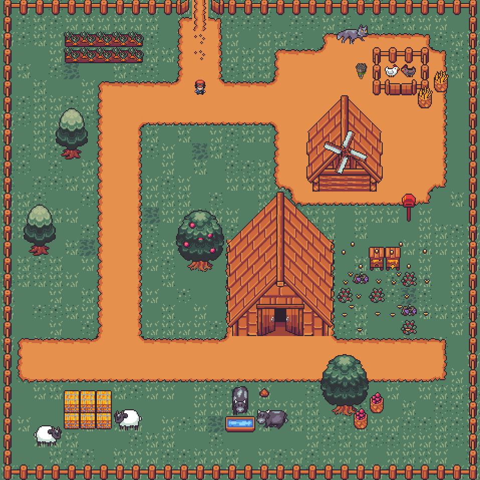
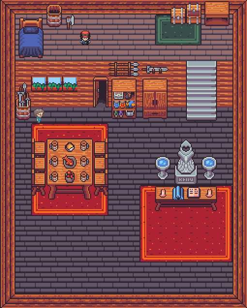

# Sandman's Adventure
## Mika Gazit, Ivy Mahncke, Charlie Mawn
#### [Our Github Page](https://github.com/olincollege/top-down-dungeon-crawler)

### The Big Idea
This game is a top down adventure game where the player will explore maps, pick up items, and interact with NPCs. The goal of this project was not only to create a fun game by the end, but also for us to explore, experiment with, and understand the intricacies of pygame, sprites, tilesets, and so much more. 

### Our Maps:
##### Credit to Clockwork Raven on Itch.io for the tilesets [link](https://itch.io/s/87673/raven-fantasy-tilesets-full-collection)
##### Credit to PizzaSun and tebited15 on DeviantArt for the player sprite [link](https://www.deviantart.com/pizzasun/art/Pokemon-XY-Male-Trainer-Gen-IV-Style-698428061)
##### Credit to Pipoya on Itch.io for the npc sprites [link](https://pipoya.itch.io/pipoya-free-rpg-character-sprites-32x32)

Here is our player! We were inspired by classic JRPGs such as Pokemon, Earthbound, and Octopath Traveler, so we wanted to use a sprite that reflects that. The player also has 4 different sprites so we can show directionality when moving around. 

Here are images of two of our maps. Using the tilesets and sprite assets provided by the sources above, we put together a total of 7 maps, each with intricate detail, at least one item, and at least one NPC. We use the [Tiled Map Editor](https://thorbjorn.itch.io/tiled) in order to design each map. 

### How to Play
In order to download the game, navigate to our github page (linked above), then follow the instructions in the README.md file to download and run. 

Throughout the map, there are many NPCs waiting to be interacted with. When talked to, they provide the player with a quest, and when completed, the NPC will be satisfied. The final goal of the game is to navigate the whole map, interact with every NPC, and find all the items that the NPCs desire in order to complete their quests. Once all the NPCs are satisfied, you win! You can either exit the game and start over, or continue exploring our maps.

### Video
Below is a video of some explaination and gameplay of our game

<video src="final_video.mp4" width="1316" height="992">

